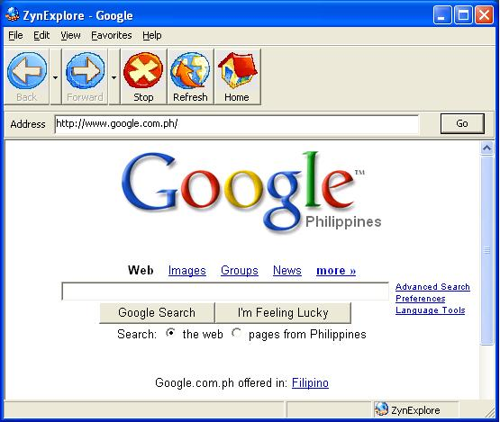

<div align="center">

## A Complete Web Browser


</div>

### Description

A complete Web browser with most of the basic functions included like copy, page properties, print, view source, back and forward subitems, progress bar, autocomplete feature, etc. I sorta copy the Internet Explorer's GUI turns out just fine. With some minor improvement, it'll be of good use to some.

Use this if you're getting bored with Internet Explorer. I have some bugs though, just debug it. LOL. Have fun!!!
 
### More Info
 


<span>             |<span>
---                |---
**Submitted On**   |2006-12-22 10:22:08
**By**             |[Juanito Dado Jr](https://github.com/Planet-Source-Code/PSCIndex/blob/master/ByAuthor/juanito-dado-jr.md)
**Level**          |Beginner
**User Rating**    |4.4 (35 globes from 8 users)
**Compatibility**  |VB 6\.0
**Category**       |[Internet/ HTML](https://github.com/Planet-Source-Code/PSCIndex/blob/master/ByCategory/internet-html__1-34.md)
**World**          |[Visual Basic](https://github.com/Planet-Source-Code/PSCIndex/blob/master/ByWorld/visual-basic.md)
**Archive File**   |[ZynExplore20398212292006\.zip](https://github.com/Planet-Source-Code/juanito-dado-jr-a-complete-web-browser__1-67498/archive/master.zip)

### API Declarations

```
Option Explicit
'autocomplete textbox
Private Declare Sub SHAutoComplete Lib "shlwapi.dll" (ByVal hwndEdit As Long, ByVal dwFlags As Long)
Private Const SHACF_AUTOAPPEND_FORCE_OFF = &amp;H80000000
Private Const SHACF_AUTOAPPEND_FORCE_ON = &amp;H40000000
Private Const SHACF_AUTOSUGGEST_FORCE_OFF = &amp;H20000000
Private Const SHACF_AUTOSUGGEST_FORCE_ON = &amp;H10000000
Private Const SHACF_DEFAULT = &amp;H0
Private Const SHACF_FILESYSTEM = &amp;H1
Private Const SHACF_URLHISTORY = &amp;H2
Private Const SHACF_URLMRU = &amp;H4
Private Const SHACF_USETAB = &amp;H8
Private Const SHACF_URLALL = (SHACF_URLHISTORY Or SHACF_URLMRU)
'progress bar in status bar
Private Declare Function SetParent Lib "user32" _
  (ByVal hWndChild As Long, ByVal hWndNewParent As Long) As Long
```


